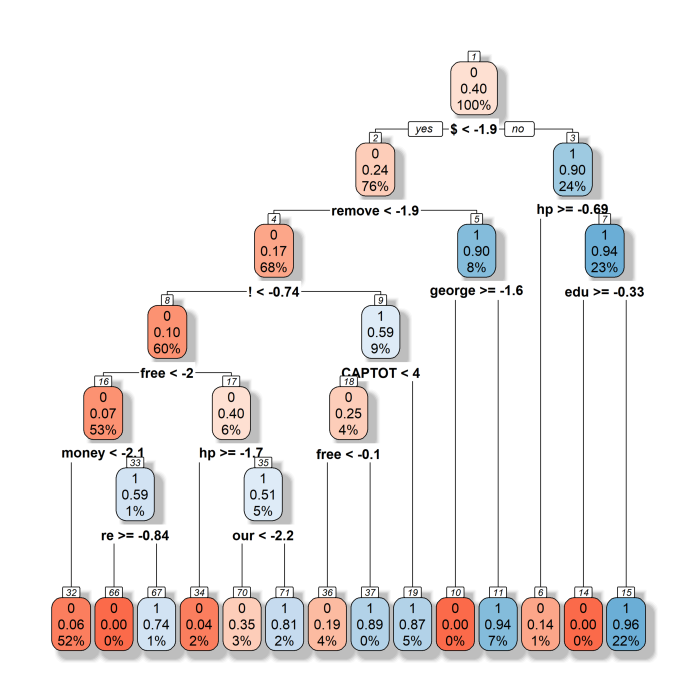

# Spam Dataset

This dataset consists of 4601 email observations, each labelled as spam (1) or not spam (0). There are 57 predictors, each being the relative frequencies of the most commonly occuring words and symbols in the email. 

We use gradient boosting in R and model blending techniques to improve our accuracy.

This dataset is discussed in "The Elements of Statistical Learning, II edition". The data is also available at ftp.ics.uci.edu.
